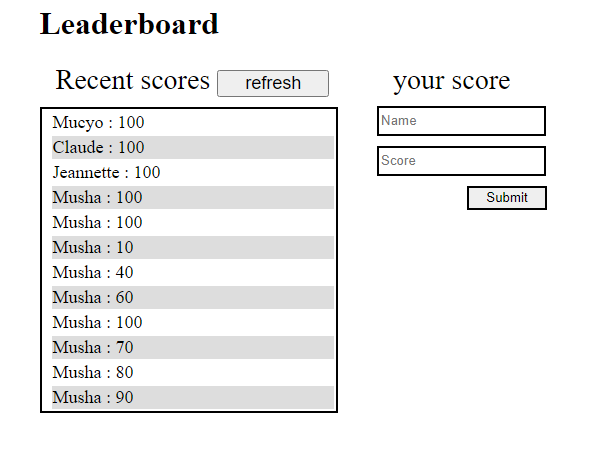

# Leaderboard

> This project is designed to display the User and scores of a game getting them from an API and creating them there.
> 

Additional description about the project and its features.

- Scores are input added through input fields
- After submitting they are sent to the API
- When you refresh it updates the score board by getting back the API information

## Built With

- Github
- JavaScript
- HTML
- CSS
- WEBPACK
- Barbel
- JSON

[Live Demo Link](https://mucyosoda.github.io/readerboard/dist/)

##periquities
To get this project up and running, you should do the following;
If you wish to run the project locally, please do the following:

1.- Install Node.js and npm if you haven't already.
To install Node.js, follow the instructions on [Node.js](https://nodejs.org/en/).

To install npm, run the following command in your terminal:

```bash
npm install -g npm
```

2.- Install webpack and linters.
To install webpack, run the following command in your terminal:

```bash
npm install -g webpack
```

or follow the instructions on [webpack](https://webpack.js.org/).
To install linters, run the following command in your terminal:

```bash
npm install -g eslint
npm install -g stylelint
npm install -g webhint
```

or follow the instructions on [eslint](https://eslint.org/), [stylelint](https://stylelint.io/), and [webhint](https://webhint.io/).

Also you can clone the repository and most of the jobs will be done for you.

Once you have the setup and the project locally, you can run the project using the following command in your terminal:

```bash
npm run build
```

and if you want to watch the changes live, run the following command:

```bash
npm start
```

also you can run `npm run watch` to make webpack watch the changes and rebuild the project without having to run the build command again.

## Tests

If you want to run the tests, do the following:
1.- Install Node.js and npm if you haven't already. Or you can use yarn if you prefer.

2.- Install Jest using npm or yarn. You can check here how to do it: [Jest](https://jestjs.io/es-ES/docs/getting-started).

3.- Run `npm test` or `yarn test` to run the tests.

4.- you can add the jest coverage so it covers all your code and show percentage left

Or

You can run `git clone https://github.com/tufoinnkuo10/LEADERBOARD.git` to clone the repository and avoid all the installation steps because tests are set as a dependency.
Happy coding!

👤 **Author**

- Name: Tufoin Nkuo
- GitHub: [@tufoinnkuo10](https://github.com/Mucyosoda)
- Twitter: [@itztenten](https://twitter.com/ClaudeMucyo1)
- LinkedIn: [LinkedIn](linkedin.com/in/claude-mucyo-b6845b223)

## 🤝 Contributing

Contributions, issues, and feature requests are welcome!

Feel free to check the [issues page](../../issues/).

## Show your support

Give a ⭐️ if you like this project!

## Acknowledgments

- This project is realised thanks to microverse

## 📝 License

This project is [MIT](./LICENSE.md) licensed.
